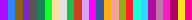

%20CI%20with%20Gradle/badge.svg)
%20CI%20with%20Gradle/badge.svg)

# Colormap

Colormap is a Java package for creating and using colormaps. It includes many "reference" colormaps, including those from [Matplotlib](https://matplotlib.org/)
, [Tableau](https://www.tableau.com/) and other sources (see [credits](#credits)). 

## Overview

- The main access to the colormaps is through ```net.mahdilamb.colormap.Colormaps```. This includes a lot of wrapper classes and the ability to list the reference colormaps ```Colormaps.named()```. 
- The wrapper classes include a reversed colormap (```Colormaps.reversedColormap()```), as well as a "fluid" colormap ```Colormaps.fluidColormap()```. A fluid colormap is not, unlike the reference colormaps, limited to the range 0-1. Instead, a fluid colormap can autoscale, or be clamped between a min and max value (see ```net.mahdilamb.colormap.FluidColormap``` for more information). Fluid colormaps can also have the backing colormap changed. 

## Using reference colormaps

Reference colormaps can either be accessed through ```Colormaps.get(String)```, which can take a String such as ```"sequential.viridis"```, ```"viridis"``` or ```"sequential.viridis.reversed"```. Alternatively, they can be accessed using a class path embedded in the Colormaps class e.g. ```Colormaps.Sequential.Viridis()``` (and then, for exampled made fluid ```Colormaps.fluidColormap(Colormaps.Sequential.Viridis())```). 

## Creating colormaps

Colormaps can be created in two ways either using a builder ```Colormaps.buildSequential()``` and ```Colormaps.buildQualitative()```, or by extending ```net.mahdilamb.colormap.SequentialColormap``` and ```net.mahdilamb.colormap.QualitativeColormap```. Reference colormaps are created by the latter approach. 

## Fluid colormaps example

As the fluid colormaps are autoranging, they fire an even when the color is changed. The below example shows how this might be done using a lambda expression. The original value is ```0```, but this changes when a new color is requested from the colormap, and the range is changed, and a new event is triggered.

```java
import net.mahdilamb.colormap.Colormaps;
import net.mahdilamb.colormap.FluidColormap;

public class Test {
    public static void main(final String[] args) {
        final FluidColormap viridis = Colormaps.fluidColormap(Colormaps.get("Viridis"));
        viridis.get(0f, color -> {
            System.out.println(color);
        });

        viridis.get(-1);
    }
}

```

## Color

The colormap package includes a Colors utility class ```net.mahdilamb.colormap.Colors```. It holds constants for the colors specified in CSS4, AWT and [Tableau](https://www.tableau.com/). 

##### Developer note

It is possible to also include the xkcd colors. The addition of the colors is done automatically from text files in ```src\test\java\net\mahdilamb\colormap\reflect\InsertColors.java```. Uncomment the line referring to the xkcd file parsing and add an extra method in the Color class.

```java
public static Color getXKCD(String name) {
    return get(ColorType.XKCD, name);
}
```

## Maven

The package can be imported from [maven](https://search.maven.org/artifact/net.mahdilamb/colormap).

## Reference colormaps
|Category|ColorMap|Sample|Source|
|---|---|---|---|
|Cyclic|Edge||[Paraview](https://www.paraview.org/)|
|Cyclic|HSV|||
|Cyclic|IceFire||[Paraview](https://www.paraview.org/)|
|Cyclic|MRYBM||[CET](https://colorcet.com/)|
|Cyclic|MYGBM||[CET](https://colorcet.com/)|
|Cyclic|Phase||[CMOcean](https://matplotlib.org/cmocean/)|
|Cyclic|Twilight||[matplotlib](https://matplotlib.org/3.1.1/gallery/color/colormap_reference.html)|
|Cyclic|TwilightShifted||[matplotlib](https://matplotlib.org/3.1.1/gallery/color/colormap_reference.html)|
|Diverging|ArmyRose||[CARTO](https://carto.com/carto-colors/)|
|Diverging|Balance||[CMOcean](https://matplotlib.org/cmocean/)|
|Diverging|BentCoolWarm||[Kenneth Moreland](https://www.kennethmoreland.com/color-advice/)|
|Diverging|BrBG||[ColorBrewer](https://colorbrewer2.org/)|
|Diverging|Curl||[CMOcean](https://matplotlib.org/cmocean/)|
|Diverging|Delta||[CMOcean](https://matplotlib.org/cmocean/)|
|Diverging|Diff||[CMOcean](https://matplotlib.org/cmocean/)|
|Diverging|Earth||[CARTO](https://carto.com/carto-colors/)|
|Diverging|Fall||[CARTO](https://carto.com/carto-colors/)|
|Diverging|Geyser||[CARTO](https://carto.com/carto-colors/)|
|Diverging|Oxy||[CMOcean](https://matplotlib.org/cmocean/)|
|Diverging|Picnic||[Plotly](https://plotly.com/python/colorscales/)|
|Diverging|PiYG||[ColorBrewer](https://colorbrewer2.org/)|
|Diverging|Portland||[Plotly](https://plotly.com/python/colorscales/)|
|Diverging|PRGn||[ColorBrewer](https://colorbrewer2.org/)|
|Diverging|PuOr||[ColorBrewer](https://colorbrewer2.org/)|
|Diverging|RdBu||[ColorBrewer](https://colorbrewer2.org/)|
|Diverging|RdGy||[ColorBrewer](https://colorbrewer2.org/)|
|Diverging|RdYlBu||[ColorBrewer](https://colorbrewer2.org/)|
|Diverging|RdYlGn||[ColorBrewer](https://colorbrewer2.org/)|
|Diverging|SmoothCoolWarm||[Kenneth Moreland](https://www.kennethmoreland.com/color-advice/)|
|Diverging|Spectral||[ColorBrewer](https://colorbrewer2.org/)|
|Diverging|TealRose||[CARTO](https://carto.com/carto-colors/)|
|Diverging|Temps||[CARTO](https://carto.com/carto-colors/)|
|Diverging|Topo||[CMOcean](https://matplotlib.org/cmocean/)|
|Diverging|Tropic||[CARTO](https://carto.com/carto-colors/)|
|Qualitative|Accent||[ColorBrewer](https://colorbrewer2.org/)|
|Qualitative|Alphabet||[Polychrome](https://cran.r-project.org/web/packages/Polychrome/index.html)|
|Qualitative|Antique||[CARTO](https://carto.com/carto-colors/)|
|Qualitative|Bold||[CARTO](https://carto.com/carto-colors/)|
|Qualitative|D3||[d3.js](https://github.com/d3/d3-scale-chromatic/blob/master/README.md#schemeCategory10)|
|Qualitative|Dark2||[ColorBrewer](https://colorbrewer2.org/)|
|Qualitative|Dark24||[Polychrome](https://cran.r-project.org/web/packages/Polychrome/index.html)|
|Qualitative|G10||[Plotly](https://plotly.com/python/colorscales/)|
|Qualitative|Light24||[Polychrome](https://cran.r-project.org/web/packages/Polychrome/index.html)|
|Qualitative|Paired||[ColorBrewer](https://colorbrewer2.org/)|
|Qualitative|Pastel||[CARTO](https://carto.com/carto-colors/)|
|Qualitative|Pastel1||[ColorBrewer](https://colorbrewer2.org/)|
|Qualitative|Pastel2||[ColorBrewer](https://colorbrewer2.org/)|
|Qualitative|Plotly||[Plotly](https://plotly.com/python/colorscales/)|
|Qualitative|Prism||[CARTO](https://carto.com/carto-colors/)|
|Qualitative|Safe||[CARTO](https://carto.com/carto-colors/)|
|Qualitative|Set1||[ColorBrewer](https://colorbrewer2.org/)|
|Qualitative|Set2||[ColorBrewer](https://colorbrewer2.org/)|
|Qualitative|Set3||[ColorBrewer](https://colorbrewer2.org/)|
|Qualitative|T10||[Plotly](https://plotly.com/python/colorscales/)|
|Qualitative|Tab10||[Tableau](https://www.tableau.com/)|
|Qualitative|Tab20||[Tableau](https://www.tableau.com/)|
|Qualitative|Tab20b||[Tableau](https://www.tableau.com/)|
|Qualitative|Tab20c||[Tableau](https://www.tableau.com/)|
|Qualitative|Vivid||[CARTO](https://carto.com/carto-colors/)|
|Sequential|AgGrnYl||[Plotly](https://plotly.com/python/colorscales/)|
|Sequential|AgSunset||[Plotly](https://plotly.com/python/colorscales/)|
|Sequential|Algae||[CMOcean](https://matplotlib.org/cmocean/)|
|Sequential|Amp||[CMOcean](https://matplotlib.org/cmocean/)|
|Sequential|BlackBody||[Kenneth Moreland](https://www.kennethmoreland.com/color-advice/)|
|Sequential|BlackbodyAlt||[Plotly](https://plotly.com/python/colorscales/)|
|Sequential|BlackBodyExtended||[Kenneth Moreland](https://www.kennethmoreland.com/color-advice/)|
|Sequential|Blues||[ColorBrewer](https://colorbrewer2.org/)|
|Sequential|BluGrn||[CARTO](https://carto.com/carto-colors/)|
|Sequential|BluYl||[CARTO](https://carto.com/carto-colors/)|
|Sequential|BrwnYl||[CARTO](https://carto.com/carto-colors/)|
|Sequential|BuGn||[ColorBrewer](https://colorbrewer2.org/)|
|Sequential|BuPu||[ColorBrewer](https://colorbrewer2.org/)|
|Sequential|Burg||[CARTO](https://carto.com/carto-colors/)|
|Sequential|BurgYl||[CARTO](https://carto.com/carto-colors/)|
|Sequential|Cividis||[matplotlib](https://matplotlib.org/3.1.1/gallery/color/colormap_reference.html)|
|Sequential|CubeYF||[MyCarta](https://mycarta.wordpress.com/2013/02/21/perceptual-rainbow-palette-the-method/)|
|Sequential|DarkMint||[CARTO](https://carto.com/carto-colors/)|
|Sequential|Deep||[CMOcean](https://matplotlib.org/cmocean/)|
|Sequential|Dense||[CMOcean](https://matplotlib.org/cmocean/)|
|Sequential|Electric||[Plotly](https://plotly.com/python/colorscales/)|
|Sequential|Emrld||[CARTO](https://carto.com/carto-colors/)|
|Sequential|GnBu||[ColorBrewer](https://colorbrewer2.org/)|
|Sequential|Gray||[CMOcean](https://matplotlib.org/cmocean/)|
|Sequential|Greens||[ColorBrewer](https://colorbrewer2.org/)|
|Sequential|Greys||[ColorBrewer](https://colorbrewer2.org/)|
|Sequential|Haline||[CMOcean](https://matplotlib.org/cmocean/)|
|Sequential|Hesperia||[Peter Karpov](http://inversed.ru/Blog_2.htm)|
|Sequential|Hot||[Plotly](https://plotly.com/python/colorscales/)|
|Sequential|Ice||[CMOcean](https://matplotlib.org/cmocean/)|
|Sequential|Inferno||[matplotlib](https://matplotlib.org/3.1.1/gallery/color/colormap_reference.html)|
|Sequential|Jet|||
|Sequential|Kindlmann||[Kindlmann et al.](https://www.kennethmoreland.com/color-advice/)|
|Sequential|KindlmannExtended||[Kindlmann et al.](https://www.kennethmoreland.com/color-advice/)|
|Sequential|KovesiBGYW||[CET](https://colorcet.com/)|
|Sequential|KovesiKRYW||[CET](https://colorcet.com/)|
|Sequential|Lacerta||[Peter Karpov](http://inversed.ru/Blog_2.htm)|
|Sequential|Laguna||[Peter Karpov](http://inversed.ru/Blog_2.htm)|
|Sequential|Magenta||[CARTO](https://carto.com/carto-colors/)|
|Sequential|Magma||[matplotlib](https://matplotlib.org/3.1.1/gallery/color/colormap_reference.html)|
|Sequential|Matter||[CMOcean](https://matplotlib.org/cmocean/)|
|Sequential|Mint||[CARTO](https://carto.com/carto-colors/)|
|Sequential|Oranges||[ColorBrewer](https://colorbrewer2.org/)|
|Sequential|OrRd||[ColorBrewer](https://colorbrewer2.org/)|
|Sequential|OrYel||[CARTO](https://carto.com/carto-colors/)|
|Sequential|Peach||[CARTO](https://carto.com/carto-colors/)|
|Sequential|PinkYl||[CARTO](https://carto.com/carto-colors/)|
|Sequential|Plasma||[matplotlib](https://matplotlib.org/3.1.1/gallery/color/colormap_reference.html)|
|Sequential|PlasmaModified||[Peter Karpov](http://inversed.ru/Blog_2.htm)|
|Sequential|Plotly3||[Plotly](https://plotly.com/python/colorscales/)|
|Sequential|PuBu||[ColorBrewer](https://colorbrewer2.org/)|
|Sequential|PuBuGn||[ColorBrewer](https://colorbrewer2.org/)|
|Sequential|PuRd||[ColorBrewer](https://colorbrewer2.org/)|
|Sequential|Purp||[CARTO](https://carto.com/carto-colors/)|
|Sequential|Purples||[ColorBrewer](https://colorbrewer2.org/)|
|Sequential|PurpOr||[CARTO](https://carto.com/carto-colors/)|
|Sequential|Rain||[CMOcean](https://matplotlib.org/cmocean/)|
|Sequential|RdPu||[ColorBrewer](https://colorbrewer2.org/)|
|Sequential|RedOr||[CARTO](https://carto.com/carto-colors/)|
|Sequential|Reds||[ColorBrewer](https://colorbrewer2.org/)|
|Sequential|Solar||[CMOcean](https://matplotlib.org/cmocean/)|
|Sequential|Speed||[CMOcean](https://matplotlib.org/cmocean/)|
|Sequential|Sunset||[CARTO](https://carto.com/carto-colors/)|
|Sequential|SunsetDark||[CARTO](https://carto.com/carto-colors/)|
|Sequential|Tarn||[CMOcean](https://matplotlib.org/cmocean/)|
|Sequential|Teal||[CARTO](https://carto.com/carto-colors/)|
|Sequential|TealGrn||[CARTO](https://carto.com/carto-colors/)|
|Sequential|Tempo||[CMOcean](https://matplotlib.org/cmocean/)|
|Sequential|Thermal||[CMOcean](https://matplotlib.org/cmocean/)|
|Sequential|Turbid||[CMOcean](https://matplotlib.org/cmocean/)|
|Sequential|Turbo||[Google AI](https://ai.googleblog.com/2019/08/turbo-improved-rainbow-colormap-for.html)|
|Sequential|Viridis||[matplotlib](https://matplotlib.org/3.1.1/gallery/color/colormap_reference.html)|
|Sequential|YlGn||[ColorBrewer](https://colorbrewer2.org/)|
|Sequential|YlGnBu||[ColorBrewer](https://colorbrewer2.org/)|
|Sequential|YlOrBr||[ColorBrewer](https://colorbrewer2.org/)|
|Sequential|YlOrRd||[ColorBrewer](https://colorbrewer2.org/)|
## Colormap credits

* Default colormaps include all [ColorBrewer 2.0](https://colorbrewer2.org/) color maps;
* Smooth Cool Warm, Bent Cool Warm, Black Body, Kindlmann, Extended
  Kindlmann (https://www.kennethmoreland.com/color-advice/)
* [Tableau](https://www.tableau.com/) colour maps
* Colormaps from [Peter Karpov](http://inversed.ru/Blog_2.htm).
* Turbo from https://ai.googleblog.com/2019/08/turbo-improved-rainbow-colormap-for.html
* ["Why We Use Bad Color Maps and What You Can Do About It."](https://doi.org/10.2352/ISSN.2470-1173.2016.16.HVEI-133)
  Kenneth Moreland.
* ["Beautiful colormaps for oceanography](https://matplotlib.org/cmocean/)
