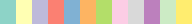

# ColorMap
A Java-based colormap/heatmap that linearly interpolates in L*ab space.

Linear and categorical colormaps can be easily created either by adding a list of colors, or by providing a list of colors with associated relative positions in the colormap.

Includes a number of default colormaps. When the bounds of the colormap nodes change, a colorChangeEvent is fired so that colored elements will also updated.

* Default colormaps include all ColorBrewer 2.0 color maps (https://colorbrewer2.org/#type=sequential&scheme=BuGn&n=3);
* Smooth Cool Warm, Bent Cool Warm, Black Body, Kindlmann, Extended Kindlmann (https://www.kennethmoreland.com/color-advice/)
* Tableau colour sets
* Colormaps from http://inversed.ru/Blog_2.htm
* Turbo from https://ai.googleblog.com/2019/08/turbo-improved-rainbow-colormap-for.html

## Default colormaps
|Category|ColorMap|Sample|
|---|---|---|
|Diverging|BentCoolWarm||
|Diverging|BrBG||
|Diverging|PRGn||
|Diverging|PiYG||
|Diverging|PuOr||
|Diverging|RdBu||
|Diverging|RdGy||
|Diverging|RdYlBu||
|Diverging|RdYlGn||
|Diverging|SmoothCoolWarm||
|Diverging|Spectral||
|Qualitative|Accent||
|Qualitative|Dark2||
|Qualitative|Paired||
|Qualitative|Pastel1||
|Qualitative|Pastel2||
|Qualitative|Set1||
|Qualitative|Set2||
|Qualitative|Set3||
|Qualitative|Tab10||
|Qualitative|Tab20||
|Qualitative|Tab20b||
|Qualitative|Tab20c||
|Sequential|BlackBody||
|Sequential|Blues||
|Sequential|BuGn||
|Sequential|BuPu||
|Sequential|Cividis||
|Sequential|ExtendedKindlmann||
|Sequential|GnBu||
|Sequential|Greens||
|Sequential|Greys||
|Sequential|Hesperia||
|Sequential|Inferno||
|Sequential|Kindlmann||
|Sequential|Lacerta||
|Sequential|Laguna||
|Sequential|Magma||
|Sequential|ModifiedPlasma||
|Sequential|OrRd||
|Sequential|Oranges||
|Sequential|Plasma||
|Sequential|PuBu||
|Sequential|PuBuGn||
|Sequential|PuRd||
|Sequential|Purples||
|Sequential|RdPu||
|Sequential|Reds||
|Sequential|Turbo||
|Sequential|Viridis||
|Sequential|YlGn||
|Sequential|YlGnBu||
|Sequential|YlOrBr||
|Sequential|YlOrRd||

## Color
The Color class extends java.awt.Color and adds convenience functions to use css and Tableau colors.

## Credits
* This product includes color specifications and designs developed by Cynthia Brewer (http://colorbrewer.org/).
* "Why We Use Bad Color Maps and What You Can Do About It." Kenneth Moreland. In Proceedings of Human Vision and Electronic Imaging (HVEI), February 2016. DOI 10.2352/ISSN.2470-1173.2016.16.HVEI-133.
