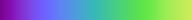

# Colormap

Colormap is a Java package for creating and using colormaps. It includes many "reference" colormaps, including those from [Matplotlib](https://matplotlib.org/)
, [Tableau](https://www.tableau.com/) and other sources (see [credits](#credits)). 

## Overview

- The main access to the colormaps is through ```net.mahdilamb.colormap.Colormaps```. This includes a lot of wrapper classes and the ability to list the reference colormaps ```Colormaps.named()```. 
- The wrapper classes include a reversed colormap (```Colormaps.reversedColormap()```), as well as a "fluid" colormap ```Colormaps.fluidColormap()```. A fluid colormap is not, unlike the reference colormaps, limited to the range 0-1. Instead, a fluid colormap can autoscale, or be clamped between a min and max value (see ```net.mahdilamb.colormap.api.FluidColormap``` for more information). Fluid colormaps can also have the backing colormap changed. 

## Using reference colormaps

Reference colormaps can either be accessed through ```Colormaps.get(String)```, which can take a String such as ```"sequential.viridis"```, ```"viridis"``` or ```"sequential.viridis.reversed"```. Alternatively, they can be accessed using a class path embedded in the Colormaps class e.g. ```Colormaps.Sequential.Viridis()``` (and then, for exampled made fluid ```Colormaps.fluidColormap(Colormaps.Sequential.Viridis())```). 

## Creating colormaps

Colormaps can be created in two ways either using a builder ```Colormaps.buildSequential()``` and ```Colormaps.buildQualitative()```, or by extending ```net.mahdilamb.colormap.SequentialColormap``` and ```net.mahdilamb.colormap.QualitativeColormap```. Reference colormaps are created by the latter approach. 

## Fluid colormaps example

As the fluid colormaps are autoranging, they fire an even when the color is changed. The below example shows how this might be done using a lambda expression. The original value is ```0```, but this changes when a new color is requested from the colormap, and the range is changed, and a new event is triggered.

```java
import net.mahdilamb.colormap.Colormaps;
import net.mahdilamb.colormap.api.FluidColormap;

public class Test {
    public static void main(final String[] args) {
        final FluidColormap viridis = Colormaps.fluidColormap(Colormaps.get("Viridis"));
        viridis.get(0f, color -> {
            System.out.println(color);
        });

        viridis.get(-1);
    }
}

```

## Color

The colormap package includes a Color class ```net.mahdilamb.colormap.Color```. It holds constants for the colors specified in CSS4, AWT and [Tableau](https://www.tableau.com/). 

##### Developer note

It is possible to also include the xkcd colors. The addition of the colors is done automatically from text files in ```src\test\java\net\mahdilamb\colormap\reflect\InsertColors.java```. Uncomment the line referring to the xkcd file parsing and add an extra method in the Color class.

```java
public static RGBA getXKCD(String name) {
    return get(ColorType.XKCD, name);
}
```

## Maven

The package can be imported from [maven](https://search.maven.org/artifact/net.mahdilamb/colormap).

## Reference colormaps
|Category|ColorMap|Sample|
|---|---|---|
|Cyclic|Twilight||
|Cyclic|TwilightShifted||
|Diverging|BentCoolWarm||
|Diverging|BrBG||
|Diverging|PiYG||
|Diverging|PRGn||
|Diverging|PuOr||
|Diverging|RdBu||
|Diverging|RdGy||
|Diverging|RdYlBu||
|Diverging|RdYlGn||
|Diverging|SmoothCoolWarm||
|Diverging|Spectral||
|Qualitative|Accent||
|Qualitative|Dark2||
|Qualitative|Paired||
|Qualitative|Pastel1||
|Qualitative|Pastel2||
|Qualitative|Set1||
|Qualitative|Set2||
|Qualitative|Set3||
|Qualitative|Tab10||
|Qualitative|Tab20||
|Qualitative|Tab20b||
|Qualitative|Tab20c||
|Sequential|BlackBody||
|Sequential|Blues||
|Sequential|BuGn||
|Sequential|BuPu||
|Sequential|Cividis||
|Sequential|CubeYF||
|Sequential|GnBu||
|Sequential|Greens||
|Sequential|Greys||
|Sequential|Hesperia||
|Sequential|Inferno||
|Sequential|Kindlmann||
|Sequential|KindlmannExtended||
|Sequential|KovesiBGYW||
|Sequential|KovesiKRYW||
|Sequential|Lacerta||
|Sequential|Laguna||
|Sequential|Magma||
|Sequential|ModifiedPlasma||
|Sequential|Oranges||
|Sequential|OrRd||
|Sequential|Plasma||
|Sequential|PuBu||
|Sequential|PuBuGn||
|Sequential|PuRd||
|Sequential|Purples||
|Sequential|RdPu||
|Sequential|Reds||
|Sequential|Turbo||
|Sequential|Viridis||
|Sequential|YlGn||
|Sequential|YlGnBu||
|Sequential|YlOrBr||
|Sequential|YlOrRd||

## Credits
* Default colormaps include all [ColorBrewer 2.0](https://colorbrewer2.org/) color maps;
* Smooth Cool Warm, Bent Cool Warm, Black Body, Kindlmann, Extended Kindlmann (https://www.kennethmoreland.com/color-advice/)
* [Tableau](https://www.tableau.com/) colour maps
* Colormaps from [Peter Karpov](http://inversed.ru/Blog_2.htm).
* Turbo from https://ai.googleblog.com/2019/08/turbo-improved-rainbow-colormap-for.html
* ["Why We Use Bad Color Maps and What You Can Do About It."](https://doi.org/10.2352/ISSN.2470-1173.2016.16.HVEI-133) Kenneth Moreland. 
